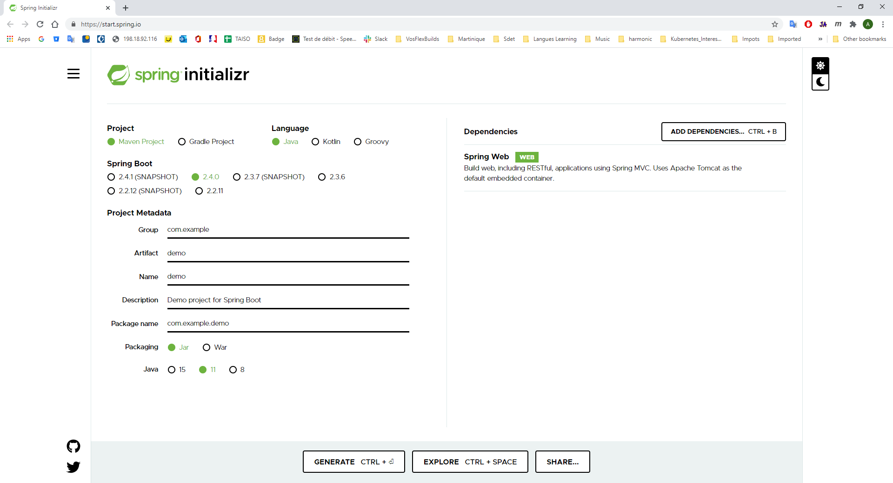

# TutoJavaSpring"

[Weblink](https://openclassrooms.com/fr/courses/4668056-construisez-des-microservices/5122884-creez-un-microservice-grace-a-spring-boot)

# Use of Spring Initializr 

# Add Product class with getter/setter + constructor.
On GetMapping(id), return the instance of Product...
Add JSON viewer extension in chrome....

Curl commands:
curl -X GET localhost:9090/products
curl -X GET localhost:9090/products/1
curl -L -X POST "localhost:9090/products" -H 'Content-Type: application/json' --data-raw '{"id": 4, "name": "Lave Linge", "price": 752}'

